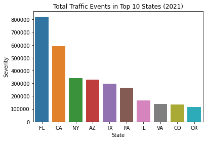
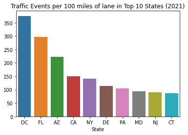
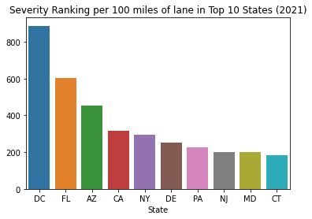
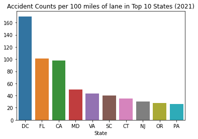
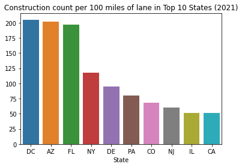
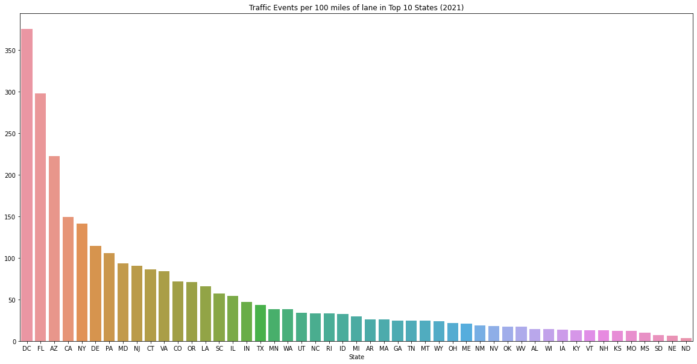
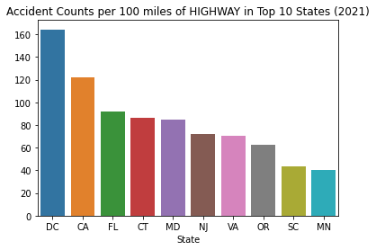
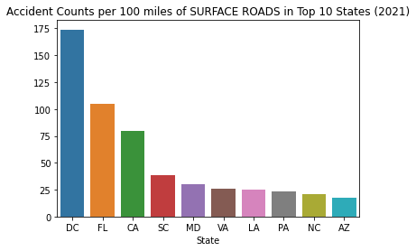

# The worst US States for getting stuck in traffic from accidents and construction.

I have long been interested in the experiences of driving across the United States. Almost everyone I have met in the United States has their own anecdotes about how bad certain states are for drivers. 

- "There is so much construction in Pennsylvania!"
- "Arizona drivers are reckless!"
- "Jersey drivers are THE WORST."

I decided to pull data that are available to me for a slightly tongue-in-cheek exercise to determine which US states actually are most unpleasant for drivers. There are several major factors that come to mind when considering "unpleasantness for drivers":

1. Traffic
2. Construction (related to traffic)
3. Accidents (related to traffic)
4. Difficulty of driving (rough roads, poorly signed roads, single-lane roads)

Traffic is the single biggest item. I don't think anyone would argue that commuting by car in San Francisco or New York City is pleasant. However, this is difficult to quantify across the entire US - in addition to requiring some measure of the speed of traffic flow, we would also need average trip lengths across the country to make a meaningful comparison. Additionally, when browsing Kaggle and the internet in general, I was unable to find a reaonably accessible dataset that would allow me to quantify the concept of "traffic."

I think most people would agree, though, that the presence of road construction and accidents both contribute to negative driving experiences. Especially when considering long distance driving, where a driver may cross multiple state boundaries, accident and construction frequency may be a better indicator of driving experiences than commuting traffic around major metropolitan areas. Personally, I have had several jobs that regularly required me to drive several hundred miles regularly, and I developed plenty of anecdotal assumptions while doing so (Ohio is OK, Pennsylvania is bad for construction, DC is bad for accidents, etc.). Lastly, I am interested in comparing US states against eachother; what is it like for a driver who is "just passing through?" I also think there is some fun to be had in a sports-like fashion by using states as the unit of comparison. I have a major grudge against Pennsylvania for the amount of traffic I have incurred on my many drives from Pittsburgh to Philadelphia, and I will try not to let this affect my judgement while conducting this analysis.

## Data

I was able to find two interesting datasets being hosted on Kaggle that pertain to accidents and construction, respectively:

- US Accidents (2016 - 2021) - https://www.kaggle.com/datasets/sobhanmoosavi/us-accidents?datasetId=199387&sortBy=voteCount
- US Road Construction and Closures (2016 - 2021) | Kaggle - https://www.kaggle.com/datasets/sobhanmoosavi/us-road-construction-and-closures

These have been assembled and gratiously provided by Sobhan Moosavi and their research team:
- Moosavi, Sobhan, Mohammad Hossein Samavatian, Srinivasan Parthasarathy, and Rajiv Ramnath. “A Countrywide Traffic Accident Dataset.”, 2019.

Already, we can imagine simply comparing the frequency of accidents and construction (hereafter called "traffic events") across states. However, such a comparison would not be very fair if we did not account for the size of a state; we would obviously expect California to have more roads than Rhode Island, and so simply comparing their absolute number of traffic events is not fair. The Federal Highway Administration provides a yearly report on the number and length of roads across the United States - we can use this to normalize our traffic event counts, and we can even compare highway vs freeway events as well as urban vs rural roads:

- Table HM-60 - Highway Statistics 2020 - Policy | Federal Highway Administration (dot.gov) - https://www.fhwa.dot.gov/policyinformation/statistics/2020/hm60.cfm

Finally, and this is especially for fun and some light ribbing, I was able to easily locate the US Federal Transportaion Administration's yearly funding allotment to each state. I am very curious about comparing the "least-pleasant" states for driving with the amount of federal funding they receive:

- FTA Allocations for Formula and Discretionary Programs by State FY 1998-2022 Full Year | FTA (dot.gov) - https://www.transit.dot.gov/funding/grants/fta-allocations-formula-and-discretionary-programs-state-fy-1998-2022-full-year

## Specific questions I plan to answer in this analysis

Using the data I have been able to collect, I plan to try and answer the following questions:

1. When we normalize for the amount of roads, which states exhibit the highest frequency of traffic events? The lowest?
2. Is there a significant difference in highway vs non-highway traffic event occurrence? Do states which fair poorly in one category also fair poorly in the other?
3. Does accident frequency correlate to construction frequency? Do these correlate in some states but not others?
4. Generally speaking, is there a correlation between the amount of funding a state receives and the amount of construction which occurs? Do accidents have any correlation with funding?

## Some notes on how this analysis was conducted.

I used the python programming language to import and analyze thesse data. If you wish to follow along yourself, you can find everything you would need to get started [here](linktorepo). There are a few things worth pointing out about the data I am looking at, without being too detailed:

1. I am only summarizing data from 2021. The collectors of these data have been compiling it yearly since 2017, using a variety of different digital sources. Their collection methods have gotten better each year, meaning that more accidents and construction events have been captured each year. I cannot do a year-over-year trend accurately, since this would be skewed by the improvements in data collection. As such, we are only going to look at 2021 data.
2. I had trouble finding data for Alaska and Hawaii, so we will only consider the 48 contiguous states, as well as Washington D.C.
3. I had to make some assumptions about what constitutes a highway, and what is a surface-street (non-highway). This is an imperfect activity, mostly based on the names of the roads (eg, "I-95" is probably a highway, while "Brown Street" is probably not a highway). Still, given the thumb-in-the-wind style of this analysis, I think it is sufficient.

With that said, let's begin!

## 1. When we normalize for the amount of roads, which states exhibit the highest frequency of traffic events? The lowest?

We can start by comparing the total counts of traffic events (defined as accidents plus construction events) across each state through 2021. We will not yet take the SIZE of a state into account - let's just look at total numbers to get started:

*Total count of traffic events by states in 2021*

This plot is meant to be a reality check that my methodology makes sense. The above looks correct for absolute values - big states lead the way. Also, LOL at Pennsylvania ranking just behind Texas for absolute counts. 

To really get a feel for "unpleasantness," we should normalize by the amount of roads a state has. By using data from the US government, I can normalize the above values to "events per 100 miles of lane." Let's see how it looks when we do so.

*Traffic event occurence per 100 imles of road by state in 2021*

Interesting! Some important notes:

1. This is just for 2021.
2. This is the number of events per 100 miles of LANE. So, your average two-way road counts for 2 lanes, so a 1 mile stretch of road is "2 miles of lane". This means that, generally, states which have more lanes (more 4 lane highways) will appear to have a smaller amount of accidents per 100 miles. I have decided NOT to adjust this, since I am trying to measure "unpleasantness of driving," and I think states deserve a reqard for having more lanes.

That being said, a big state like New York has about 75 events per year per 100 miles of two lane road. That... sounds reasonable, I think. Between fender benders and construction, I really think this sounds about right. This is almost CERTAINLY weighted heavily by more traveled roads, but I think this is a nice first swing.

Washington D.C. leads the way for most traffic incidents per 100 miles of lane! This alone seems to validate this methodology to me, as D.C. features some very difficult driving. Florida, California, and New York also make sense to me as ranking highly. I am a little surprised by Arizona's ranking, as its infrastructure is much newer than the other states listed here, but it's very populous. Interestingly, while Texas made the top ten list for overall events, it does NOT rank highly for events per 100 miles. The same is true for Illinois and Virginia, so I assume the size of these states normalizes for this. Texas is the second most populated state in the US, so I guess they deserve some credit for keeping traffic events down. 

Let's look at these rankings when we include SEVERITY. Instead of just counting events, this uses the Severity field, where construction or traffic is ranked from 1 to 4. Note - I have NOT been able to determine what exactly these rankings mean, but it seems a shame to not use this data, especially for such a thumb-in-the-wind analysis as this one.

*Traffic event occurence per 100 miles of road by state, weighted by severity, in 2021*

Interesting again! The rankings are almost completely unchanged, with only New Jerey and Maryland swapping positions. It doesn't look like "severity" introduces a lot of changes in the rankings, so for the sake of simplicity and interpretability, we will only consider event occurences. This means that a fender bender carries the same weight as a fatal accident, but it does make our analysis easier to understand, so we will accept the tradeoff.

*Accidents per 100 miles of road by state in 2021*

*Construction per 100 miles of road by state in 2021*

Washington D.C. takes the top spot for everything! This seems a little unfair, as a better comparison for DC would probably just be a major city like New York or LA. However, "DC is a terrible place to drive" rolls off the tongue pretty easily, so I will keep it there.

Some interesting observations, now that we have everything plotted:
- Arizona has a ton of construction, but does not hit the top 10 rankings for accidents per 100 miles. I think anyone who has driven in Arizona can believe this, as their infrastructure is relatively new compared to most states.
- Florida ranks highly for construction and accidents. Unsurprising.
- New York ranks high for construction, but not for accidents. This DOES surprise me, although it probably does not surprise New Yorkers, based on the egos of drivers I have met from there. I think New York City really warranta a city-based version of this analysis.
- Pennsylvania just makes the top 10 for accident occurences, and is 6th for construction. I have spent a lot of time driving across Pennsylvania, and I have to admit, I thought PA would have ranked worse here. I guess if you count PA as a big-time East-Coast state this is to be expected, but if you compare it to non-coastal neighbors like Ohio or West Virginia it feels pretty bad.
- Kudos to Texas, for ranking highly for TOTAL events but not making the top 10 for EITHER accidents or construction per 100 miles of lane.

Overall, I think this analysis actually has some merit, as it matches some of my pre-existing notions about driving in these states.

Just for fun, let's look at everything!

*Traffic events per 100 miles of road for every state in 2021*

I find it amazing how low Texas appears on this list, given how populous it is. The Dakotas and Nebraska are, unsurprisingly, our least eventful states.

## 2. Is there a significant difference in highway vs non-highway traffic event occurrence? Do states which fair poorly in one category also fair poorly in the other?

Now, let's separate highway and non-highway events.

*Accidents per 100 miles of highway lane for every state in 2021*

*Accidents per 100 miles of surface street lane for every state in 2021*

DC leads the way for accidents on and off the highway. After that, we see some interesting findings. South Carolina is bad for both, but ranks significantly worse for surface street accidents than for highway accidents. Conversely, New Jersey ranks poorly for highway accidents, but does NOT rank in the top 10 for surface street accidents. Again, some of my pre-existing biases are being confirmed here - who gets off the highway in Jersey? 

However, the top 10 for accidents are largely the same - Florida and California fare poorly, and Maryland and Virginia rank poorly as well. It would probably be useful to show the ranks for these side by side.

These data are starting to get a little tricky to compare visually - it may be easier to print the data to a table and look at the rankings for each state. A lower rank means that a state has either more accidents, construction, or both.

| State   |   TotalEvents |   AccidentsHighway |   AccidentsRoad |   ConstructionHighway |   ConstructionRoad |   FederalFunding |
|:--------|--------------:|-------------------:|----------------:|----------------------:|-------------------:|-----------------:|
| DC      |             1 |                  1 |               1 |                     1 |                  2 |               15 |
| FL      |             2 |                  3 |               2 |                     4 |                  3 |                9 |
| AZ      |             3 |                 15 |              10 |                    30 |                  1 |               12 |
| CA      |             4 |                  2 |               3 |                    11 |                 11 |                1 |
| NY      |             5 |                 11 |              11 |                    10 |                  4 |                2 |
| DE      |             6 |                 12 |              14 |                     2 |                  5 |               38 |
| PA      |             7 |                 14 |               8 |                     3 |                  6 |                8 |
| MD      |             8 |                  5 |               5 |                    23 |                 10 |               10 |
| NJ      |             9 |                  6 |              16 |                     8 |                  9 |                4 |
| CT      |            10 |                  4 |              18 |                     6 |                 14 |               16 |
| VA      |            11 |                  7 |               6 |                    15 |                 12 |               19 |
| CO      |            12 |                 29 |              36 |                     5 |                  8 |               22 |
| OR      |            13 |                  8 |              15 |                     7 |                 23 |               23 |
| LA      |            14 |                 18 |               7 |                     9 |                 16 |               27 |
| SC      |            15 |                  9 |               4 |                    18 |                 42 |               32 |
| IL      |            16 |                 36 |              26 |                    25 |                  7 |                3 |
| IN      |            17 |                 26 |              30 |                    12 |                 13 |               13 |
| TX      |            18 |                 24 |              13 |                    19 |                 18 |                6 |
| MN      |            19 |                 10 |              19 |                    29 |                 24 |               11 |
| WA      |            20 |                 21 |              23 |                    17 |                 19 |                5 |
| UT      |            21 |                 13 |              17 |                    31 |                 28 |               24 |
| NC      |            22 |                 17 |               9 |                    36 |                 35 |               20 |
| RI      |            23 |                 19 |              33 |                    21 |                 22 |               35 |
| ID      |            24 |                 32 |              22 |                    22 |                 20 |               41 |
| MI      |            25 |                 27 |              21 |                    45 |                 15 |               21 |
| AR      |            26 |                 30 |              31 |                    14 |                 30 |               36 |
| MA      |            27 |                 38 |              38 |                    32 |                 17 |                7 |
| GA      |            28 |                 25 |              35 |                    27 |                 26 |               14 |
| TN      |            29 |                 16 |              12 |                    46 |                 41 |               25 |
| MT      |            30 |                 20 |              20 |                    20 |                 45 |               44 |
| WY      |            31 |                 40 |              45 |                    24 |                 36 |               48 |
| OH      |            32 |                 43 |              29 |                    28 |                 25 |               18 |
| ME      |            33 |                nan |              48 |                    37 |                 21 |               39 |
| NM      |            34 |                 39 |              43 |                    13 |                 37 |               31 |
| NV      |            35 |                 31 |              32 |                    16 |                 43 |               28 |
| OK      |            36 |                 45 |              27 |                    26 |                 34 |               33 |
| WV      |            37 |                 22 |              25 |                    33 |                 38 |               43 |
| AL      |            38 |                 23 |              28 |                    39 |                 40 |               29 |
| WI      |            39 |                 46 |              47 |                    40 |                 29 |               26 |
| IA      |            40 |                 33 |              34 |                    44 |                 31 |               34 |
| KY      |            41 |                 41 |              44 |                    38 |                 32 |               30 |
| VT      |            42 |                nan |              46 |                    48 |                 27 |               49 |
| NH      |            43 |                 44 |              42 |                    35 |                 33 |               46 |
| KS      |            44 |                 35 |              40 |                    34 |                 39 |               37 |
| MO      |            45 |                 28 |              24 |                    43 |                 46 |               17 |
| MS      |            46 |                 34 |              37 |                    41 |                 44 |               40 |
| SD      |            47 |                 47 |              49 |                    42 |                 48 |               45 |
| NE      |            48 |                 42 |              41 |                    47 |                 47 |               42 |
| ND      |            49 |                 37 |              39 |                    49 |                 49 |               47 |

Ranking the states is fun! Some more interesting observations:
- Arizona has a ton of surface street construction. If you have been to Arizona, this is not surprising.
- I personally find it interesting that Pennsylvania ranks so highly for highway construction at #3. This is NOT surprising, based on my driving experiences. While it is populous, it is not all that large, area-wise. Pennsylvania, why are you fixing your highways so often? [FIX YOUR BRIDGES](https://apnews.com/article/joe-biden-business-pittsburgh-bridge-collapses-b91476e4d1dc1c7839bd0c39e7be186e)!
- California, New York, and Illinois are the top 3 federal funding-receiving states. Definitely sounds related to major cities.
- The Dakotas and Nebraska are at the bottom of our rankings. This is not too surprising, and serves as another reality-check that there is some validity to this method of analysis.

Just scanning these data, it looks like highway and non-highway events are SOMEWHAT correlated. This makes some sense - maybe construction and accidents are more regionally related than they are road-specific related. However, there is a chance that our data are also skewed here - maybe data collection is better in some states than in others. However, we still see less-traveled states near the bottom, so I do not doubt our data that much.

## 3. Does accident frequency correlate to construction frequency? Do these correlate in some states but not others?

Let's look at a little correlation matrix. Generally speaking, a number closer to 1 in the table below means that row- and column- labels are correlated, and a number closer to 0 means they are not.

|                     |   TotalEvents |   AccidentsHighway |   AccidentsRoad |   ConstructionHighway |   ConstructionRoad |   FederalFunding |
|:--------------------|--------------:|-------------------:|----------------:|----------------------:|-------------------:|-----------------:|
| TotalEvents         |      1        |           0.802235 |        0.875641 |              0.721393 |           0.914098 |         0.345965 |
| AccidentsHighway    |      0.802235 |           1        |        0.835743 |              0.673939 |           0.535048 |         0.451244 |
| AccidentsRoad       |      0.875641 |           0.835743 |        1        |              0.597159 |           0.657964 |         0.329201 |
| ConstructionHighway |      0.721393 |           0.673939 |        0.597159 |              1        |           0.525718 |         0.247874 |
| ConstructionRoad    |      0.914098 |           0.535048 |        0.657964 |              0.525718 |           1        |         0.232226 |
| FederalFunding      |      0.345965 |           0.451244 |        0.329201 |              0.247874 |           0.232226 |         1        |

The correlation matrix has some interesting findings for us.
- Highway accidents correlate very strongly to surface street accidents. One possible interpretation of this information is that accident frequency is regionally dependent, but NOT dependent on a specific roadway or type of road. Maybe local culture, laws, or driving habits contribute to this?
- Construction on highways vs surface streets are somewhat correlated. This sounds about right - certain states probably tend to spend more than others.
- Accidents and construction are MODERATELY correlated. I would have expected a stronger correlation, but some connection makes sense.
- Federal funding does not correlate very strongly to anything. There is SOME correlation to highway accidents (0.45), but this seems like grasping for straws. I don't think we can make any intelligent observations based on how funding relates to road events. I would have EXPECTED highway construction to correlate with Federal funding, especially on interstates. However, such is not the case.

## Summary, and some light conclusions

This analysis began with a not-very-scentific question - what are the least pleasant states for driving? Accident and construction data have been made readily available by Sobhan Moosavi and their research team, and this seemed like a great place to start trying to come up with a numeric answer to this question.

I call the following statements "light conclusions," since this is a very preliminary analysis which just averages event occurences across entire states. Still, I think it is an interesting first step at quantifying how likely a person is to get stuck in traffic from a "traffic event":

1. When we normalize for the amount of roads, which states exhibit the highest frequency of traffic events? The lowest?
    - Overall, Washington D.C. easily ranks higher than any US state for occurence of traffic events per 100 miles of road. Moving on to states, we see expected states appearing as the most likely to have traffic events: Florida, California, Arizona, New York, Delaware, and Pennslyvania rank highly. Arizona is an outlier here, as it leads the US for surface street construction but no other categories. 
    - Likewise, expected states with low populations feature low traffic events overall, including the Dakotas, Nebraska, Mississippi, and Missouri. 
2. Is there a significant difference in highway vs non-highway traffic event occurrence? Do states which fair poorly in one category also fair poorly in the other?
    - Overall, there is a correlation between highway vs non-highway events, but there are some interesting outliers:
        - As stated above, Arizona has a very large amount of non-highway construction occurring, but it ranks 30th for highway construction. This is very interesting, given the size of Arizona and the need for higways.
        - Conversely, Pennsylvania, a smaller state by area, ranks number 3 for highway construction. It also ranks 6 for road construction, however, so there is not a major difference here.
        - New Jersey and Connecticut both rank very highly for highway accidents, but do not make the top 10 for surface street accidents. My uneducated guess for New Jersey is that there is a large group of drivers from surrounding states passing through for work or to get to New York or Phildelphia. 
        - In general, states with lots of highway accidents also have lots of surface street accidents. This is less true for construction - there is only moderate correlation between highway and surface street construction. 
3. Does accident frequency correlate to construction frequency? Do these correlate in some states but not others?
    - There is SOME correlation between accidents of all kinds and construction of all kinds. As a long-distance driver, I have wondered about the relationship between road-blocking construction and accidents. If I were a government planner, I think there is ABSOLUTELY enough evidence of a correlation here to dig deeper and better understand this relationship - a correation of over 0.5 in a flippant analysis like this definitely indicates that there exists SOME relationship. 
4. Generally speaking, is there a correlation between the amount of funding a state receives and the amount of construction which occurs? Do accidents have any correlation with funding?
    - Overall, there is a poor relationship. When looking through the details of the funding data, I do not see anything that stands out as "road work funding," so it's maybe no surprise that we do not see a correlation here. However, the absence of a negative correlation with accidents may be telling - wouldn't we expect an inverse relationship between federal funding and accidents? That being said, the funding looks targeted at things like public transportation and emissions, so maybe this is not a surprise.
    - States with big cities rank highly - California, New York, and Illinois lead the way. This matches with my original thoughts, being that the funding is more closely aligned with urban-planning and managment activities.

This has been an entertaining exploration of these data. There were some surprises here, but the states which have lots of traffic events did not end up surpsing me all that much. If I wanted to spend more time here, I think the next step would definitely be to break this down into smaller regions, so we could account for major cities and surrounding rural areas. It would be great to get some "true" traffic information as well, but I think that is a tougher nut to crack. Here's to hoping that Pennsylvania gets those highways repaired!

- Rocco Panella, 2022 May 5